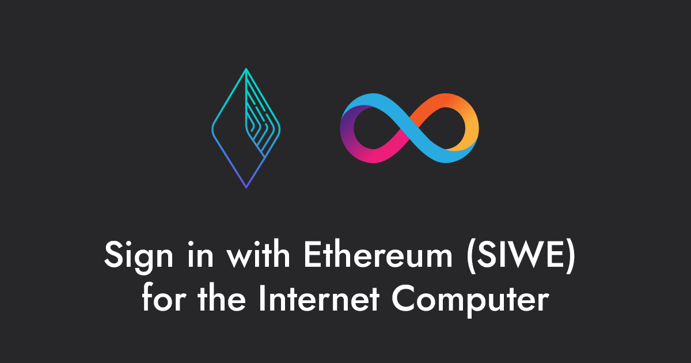

[![Crate][crate-image]][crate-link] [![Docs][docs-image]][docs-link]

`ic_siwe` is a Rust library that facilitates the integration of Ethereum wallet-based authentication with applications on the Internet Computer (ICP) platform. The library provides all necessary tools for integrating Sign-In with Ethereum (SIWE) into ICP canisters, from generating SIWE messages to creating delegate identities.

`ic_siwe` is part of the [ic-siwe](https://github.com/kristoferlund/ic-siwe) project. The goal of the project is to enhance the interoperability between Ethereum and the Internet Computer platform, enabling developers to build applications that leverage the strengths of both platforms.

See this video from the ICP Chain Fusion Hackathon for an overview as well as a deep dive how the SIWE flow works:

[](https://www.youtube.com/watch?v=lQV4Otp6Y_s)

## Key Features

- **Ethereum Wallet Sign-In**: Enables Ethereum wallet sign-in for ICP applications. Sign in with any eth wallet to generate an ICP identity and session.
- **Session Identity Uniqueness**: Ensures that session identities are specific to each application's context, preventing cross-app identity misuse.
- **Consistent Principal Generation**: Guarantees that logging in with an Ethereum wallet consistently produces the same Principal, irrespective of the client used.
- **Direct Ethereum Address to Principal Mapping**: Creates a one-to-one correlation between Ethereum addresses and Principals within the scope of the current application.
- **Timebound Sessions**: Allows developers to set expiration times for sessions, enhancing security and control.

## Table of Contents

- [Prebuilt `ic_siwe_provider` canister](#prebuilt-ic_siwe_provider-canister)
- [Demo applications](#demo-applications)
- [The SIWE Standard](#the-siwe-standard)
- [Login flow](#login-flow)
  - [SIWE canister interface](#siwe-canister-interface)
  - [`siwe_prepare_login`](#siwe_prepare_login)
  - [`siwe_login`](#siwe_login)
  - [`siwe_get_delegation`](#siwe_get_delegation)
- [Crate features](#crate-features)
- [Updates](#updates)
- [Contributing](#contributing)
- [Author](#author)
- [License](#license)

## Prebuilt `ic_siwe_provider` canister

While the `ic_siwe` library can be integrated with any Rust based ICP project, using the pre built [ic-siwe-provider](https://github.com/kristoferlund/ic-siwe/tree/main/packages/ic_siwe_provider) canister is the easiest way to integrate Ethereum wallet authentication into your application.

The canister is designed as a plug-and-play solution for developers, enabling easy integration into existing ICP applications with minimal coding requirements. By adding the pre built `ic_siwe_provider` canister to the `dfx.json` of an ICP project, developers can quickly enable Ethereum wallet-based authentication for their applications. The canister simplifies the authentication flow by managing the creation and verification of SIWE messages and handling user session management.

## Demo applications

  - [ic-siwe-react-demo](https://github.com/kristoferlund/ic-siwe-react-demo-rust): React demo with Rust backend.
  - [ic-siwe-vanilla-ts-demo](https://github.com/kristoferlund/ic-siwe-vanilla-ts-demo): Vanilla JS/TS demo Rust backend.

## The SIWE Standard

[ERC-4361: Sign-In with Ethereum](https://eips.ethereum.org/EIPS/eip-4361) - Off-chain authentication for Ethereum accounts to establish sessions

The SIWE standard defines a protocol for off-chain authentication of Ethereum accounts. The protocol is designed to enable Ethereum wallet-based authentication for applications on other platforms, such as the Internet Computer. At the core of the protocol is the SIWE message, which is a signed message that contains the Ethereum address of the user and some additional metadata. The SIWE message is signed by the user's Ethereum wallet and then sent to the application's backend. The backend verifies the signature and Ethereum address and then creates a session for the user.

`ic_siwe` implements most parts of the Sign In with Ethereum (SIWE standard,
[EIP-4361](https://eips.ethereum.org/EIPS/eip-4361) with some notable exceptions:

- `not-before`, `request-id`, `resources` - Not implemented. These fields are marked as OPTIONAL in the SIWE standard and are not required for current implementation.

## Login flow

Creating a delegate identity using `ic_siwe` is a three-step process that consists of the following steps:
1. Prepare login
2. Login
3. Get delegation

An implementing canister is free to implement these steps in any way it sees fit. It is recommended though that implementing canisters follow the login flow described below and implement the SIWE canister interface. Doing so ensures that the canister is compatible with the [ic-siwe-js](https://github.com/kristoferlund/ic-siwe/tree/main/packages/ic_siwe_js) React hook and context provider.

The login flow is illustrated in the following diagram:

```text
                                ┌────────┐                                        ┌────────┐                              ┌─────────┐
                                │Frontend│                                        │Canister│                              │EthWallet│
   User                         └───┬────┘                                        └───┬────┘                              └────┬────┘
    │      Push login button       ┌┴┐                                                │                                        │
    │ ────────────────────────────>│ │                                                │                                        │
    │                              │ │                                                │                                        │
    │                              │ │          siwe_prepare_login(eth_address)      ┌┴┐                                       │
    │                              │ │ ─────────────────────────────────────────────>│ │                                       │
    │                              │ │                                               └┬┘                                       │
    │                              │ │                OK, siwe_message                │                                        │
    │                              │ │ <─ ─ ─ ─ ─ ─ ─ ─ ─ ─ ─ ─ ─ ─ ─ ─ ─ ─ ─ ─ ─ ─ ─ ─                                        │
    │                              │ │                                                │                                        │
    │                              │ │                                   Sign siwe_message                                    ┌┴┐
    │                              │ │ ──────────────────────────────────────────────────────────────────────────────────────>│ │
    │                              │ │                                                │                                       │ │
    │                              │ │                  Ask user to confirm           │                                       │ │
    │ <───────────────────────────────────────────────────────────────────────────────────────────────────────────────────────│ │
    │                              │ │                                                │                                       │ │
    │                              │ │                          OK                    │                                       │ │
    │  ─ ─ ─ ─ ─ ─ ─ ─ ─ ─ ─ ─ ─ ─ ─ ─ ─ ─ ─ ─ ─ ─ ─ ─ ─ ─ ─ ─ ─ ─ ─ ─ ─ ─ ─ ─ ─ ─ ─ ─ ─ ─ ─ ─ ─ ─ ─ ─ ─ ─ ─ ─ ─ ─ ─ ─ ─ ─ ─ >│ │
    │                              │ │                                                │                                       └┬┘
    │                              │ │                                      OK, signature                                      │
    │                              │ │ <─ ─ ─ ─ ─ ─ ─ ─ ─ ─ ─ ─ ─ ─ ─ ─ ─ ─ ─ ─ ─ ─ ─ ─ ─ ─ ─ ─ ─ ─ ─ ─ ─ ─ ─ ─ ─ ─ ─ ─ ─ ─ ─ ─
    │                              │ │                                                │                                        │
    │                              │ │────┐                                           │                                        │
    │                              │ │    │ Generate random session_identity          │                                        │
    │                              │ │<───┘                                           │                                        │
    │                              │ │                                                │                                        │
    │                              │ │             siwe_login(eth_address,            │                                        │
    │                              │ │          signature, session_identity)         ┌┴┐                                       │
    │                              │ │ ─────────────────────────────────────────────>│ │                                       │
    │                              │ │                                               │ │                                       │
    │                              │ │                                               │ │────┐                                  │
    │                              │ │                                               │ │    │ Verify signature and eth_address │
    │                              │ │                                               │ │<───┘                                  │
    │                              │ │                                               │ │                                       │
    │                              │ │                                               │ │────┐                                  │
    │                              │ │                                               │ │    │ Prepare delegation               │
    │                              │ │                                               │ │<───┘                                  │
    │                              │ │                                               └┬┘                                       │
    │                              │ │     OK, canister_pubkey, delegation_expires    │                                        │
    │                              │ │ <─ ─ ─ ─ ─ ─ ─ ─ ─ ─ ─ ─ ─ ─ ─ ─ ─ ─ ─ ─ ─ ─ ─ ─                                        │
    │                              │ │                                                │                                        │
    │                              │ │     siwe_get_delegation(delegation_expires)   ┌┴┐                                       │
    │                              │ │ ─────────────────────────────────────────────>│ │                                       │
    │                              │ │                                               └┬┘                                       │
    │                              │ │                 OK, delegation                 │                                        │
    │                              │ │ <─ ─ ─ ─ ─ ─ ─ ─ ─ ─ ─ ─ ─ ─ ─ ─ ─ ─ ─ ─ ─ ─ ─ ─                                        │
    │                              │ │                                                │                                        │
    │                              │ │────┐                                           │                                        │
    │                              │ │    │ Create delegation identity                │                                        │
    │                              │ │<───┘                                           │                                        │
    │                              └┬┘                                                │                                        │
    │ OK, logged in with            │                                                 │                                        │
    │ Principal niuiu-iuhbi...-oiu  │                                                 │                                        │
    │ <─ ─ ─ ─ ─ ─ ─ ─ ─ ─ ─ ─ ─ ─ ─                                                  │                                        │
  User                          ┌───┴────┐                                        ┌───┴────┐                              ┌────┴────┐
                                │Frontend│                                        │Canister│                              │EthWallet│
                                └────────┘                                        └────────┘                              └─────────┘
```

### `siwe_prepare_login`

- The `siwe_prepare_login` method is called by the frontend application to initiate the login flow. The method takes the user's Ethereum address as a parameter and returns a SIWE message together with a nonce. The frontend application uses the SIWE message to prompt the user to sign the message with their Ethereum wallet.
- See: [`login::prepare_login`](src/login.rs)

### `siwe_login`

- The `siwe_login` method is called by the frontend application after the user has signed the SIWE message. The method takes the user's Ethereum address, signature, session identity and nonce as parameters. The method verifies the signature and Ethereum address and prepares the delegation to be fetched in the next step, the `siwe_get_delegation` function.
- See: [`login::login`](src/login.rs)

### `siwe_get_delegation`

- The `siwe_get_delegation` method is called by the frontend application after a successful login. The method takes the delegation expiration time as a parameter and returns a delegation.
- The `siwe_get_delegation` method is not mirrored by one function in the `ic_siwe` library. The creation of delegate identities requires setting the certified data of the canister. This should not be done by the library, but by the implementing canister.
- Creating a delegate identity involves interacting with the following `ic_siwe` functions: [`delegation::generate_seed`](src/delegation.rs),[`delegation::create_delegation`](src/delegation.rs), [`delegation::create_delegation_hash`](src/delegation.rs), [`delegation::witness`](src/delegation.rs), [`delegation::create_certified_signature`](src/delegation.rs).
- For a full implementation example, see the [`ic_siwe_provider`](https://github.com/kristoferlund/ic-siwe/tree/main/packages/ic_siwe_provider) canister.

## Updates

See the [CHANGELOG](CHANGELOG.md) for details on updates.

## Contributing

Contributions are welcome. Please submit your pull requests or open issues to propose changes or report bugs.

## Author

- [kristofer@fmckl.se](mailto:kristofer@fmckl.se)
- Twitter: [@kristoferlund](https://twitter.com/kristoferlund)
- Discord: kristoferkristofer
- Telegram: [@kristoferkristofer](https://t.me/kristoferkristofer)

## License

This project is licensed under the MIT License. See the LICENSE file for more details.

[crate-image]: https://buildstats.info/crate/ic_siwe
[crate-link]: https://crates.io/crates/ic_siwe
[docs-image]: https://docs.rs/ic_siwe/badge.svg
[docs-link]: https://docs.rs/ic_siwe/
